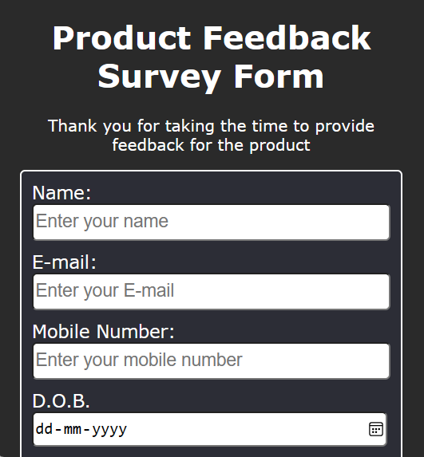

# Product Feedback Survey Form

This is a simple Product Feedback Survey Form designed using HTML and CSS.

## Form Fields

- **Name**: Input field for user's name.
- **E-mail**: Input field for user's email address.
- **Mobile Number**: Input field for user's mobile number.
- **Date of Birth**: Input field for user's date of birth.
- **Product Selection**: Dropdown menu to select the product for feedback.
- **Rating**: Radio buttons to rate the product from 1 to 5.
- **Favorite Companies**: Checkboxes to select favorite companies related to the product.
- **Suggestions or Comments**: Textarea for users to provide any suggestions or comments.
- **Submit Button**: Button to submit the form.

## Implementation Details

- **HTML**: Contains the structure and form elements.
- **CSS**: Provides styles for layout, inputs, labels, and buttons.

## Preview

